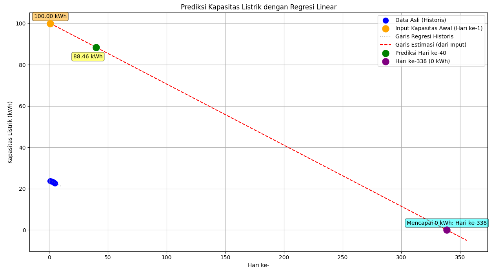
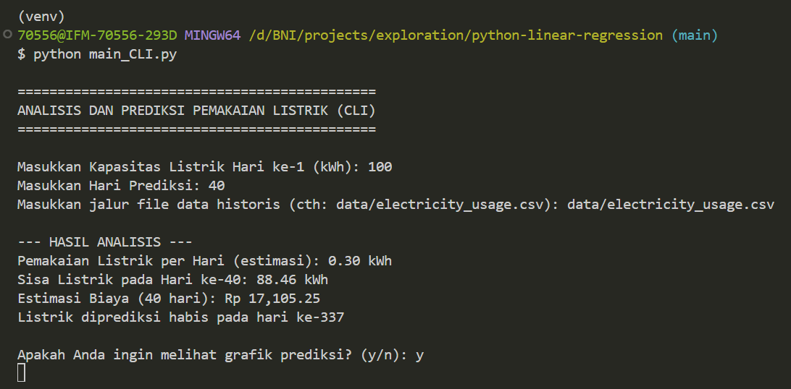
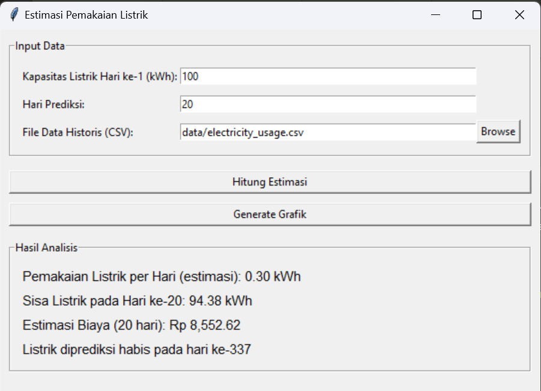

# Analisis dan Prediksi Pemakaian Listrik

## Tampilan Aplikasi

- Tampilan output grafik



- Tampilan Aplikasi (CLI)



- Tampilan Aplikasi (GUI)



## Deskripsi

Proyek ini adalah sebuah aplikasi Python yang dirancang untuk menganalisis data pemakaian listrik harian menggunakan regresi linear. Program ini mampu memprediksi sisa kapasitas listrik, memperkirakan kapan listrik akan habis, dan menghitung estimasi biaya berdasarkan tarif PLN.

Proyek ini menyediakan dua antarmuka yang berbeda untuk pengguna:

* **Command-Line Interface (CLI)**: Berinteraksi melalui terminal.
* **Graphical User Interface (GUI)**: Antarmuka visual yang mudah digunakan.

-----

## Fitur Utama

* **Regresi Linear**: Melatih model prediksi berdasarkan data historis dari file CSV.
* **Prediksi Dinamis**: Memperkirakan sisa listrik dan total biaya berdasarkan kapasitas awal yang diinputkan pengguna.
* **Estimasi Biaya**: Menghitung biaya pemakaian listrik berdasarkan tarif PLN (R1/1300VA).
* **Visualisasi Grafik**: Menampilkan grafik regresi dan garis prediksi yang interaktif.
* **Dua Antarmuka**: Tersedia dalam versi CLI (untuk pengguna tingkat lanjut) dan GUI (untuk kemudahan penggunaan).

-----

## Persyaratan

Pastikan Anda telah menginstal pustaka Python berikut. Anda dapat menginstalnya menggunakan `pip`:

```bash
pip install pandas scikit-learn matplotlib numpy pyinstaller
```

-----

## Struktur File

Proyek ini memiliki struktur yang terorganisir untuk memisahkan logika, data, dan antarmuka.

```tree
.
├── main_CLI.py              # Program versi Command-Line Interface
├── main_GUI.py              # Program versi Graphical User Interface
├── data/
│   └── electricity_usage.csv  # Data historis pemakaian listrik
├── dist/
│   └── main_GUI.exe            # versi executable dari program
├── README.md                # Dokumentasi proyek
└── requirements.txt         # Daftar pustaka yang diperlukan
```

-----

## Cara Menggunakan

### Versi CLI

Untuk menjalankan program melalui terminal, navigasikan ke direktori proyek Anda dan jalankan perintah berikut:

```bash
python main_CLI.py
```

Program akan meminta Anda untuk memasukkan:

1. Kapasitas listrik pada hari ke-1.
2. Hari target prediksi.
3. Jalur ke file CSV data historis.

Setelah input, program akan menampilkan hasil analisis di terminal dan menawarkan opsi untuk menampilkan grafik.

### Versi GUI

Untuk menjalankan program dengan antarmuka grafis, jalankan perintah ini di terminal:

```bash
python main_GUI.py
```

Sebuah jendela akan muncul di mana Anda bisa memasukkan data dan menekan tombol untuk melakukan perhitungan atau menghasilkan grafik.

-----

## Mengemas ke File .exe (Windows)

Anda dapat mengemas program GUI menjadi satu file yang dapat dieksekusi (.exe) menggunakan **PyInstaller**. Ini memungkinkan Anda untuk mendistribusikan program tanpa mengharuskan pengguna menginstal Python atau pustaka tambahan.

1. Pastikan `PyInstaller` sudah terinstal.
2. Buka terminal di direktori proyek Anda.
3. Jalankan perintah berikut:

<!-- end list -->

```bash
pyinstaller --onefile --windowed main_GUI.py
```

File `main_GUI.exe` akan dibuat di dalam folder `dist/`. Pastikan Anda mendistribusikan folder `data/` bersama dengan file `.exe` ini.
