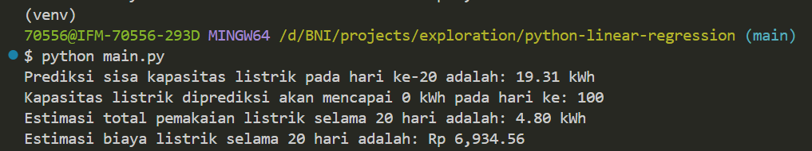
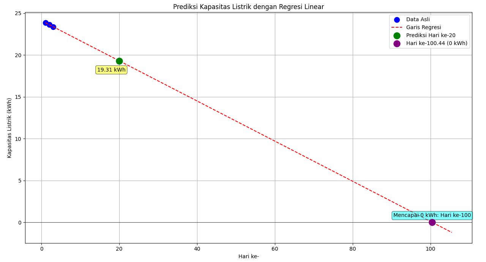

# Analisis dan Prediksi Pemakaian Listrik

Proyek ini adalah program Python modular yang menganalisis data pemakaian listrik harian menggunakan regresi linear. Program ini memprediksi sisa kapasitas listrik, memperkirakan kapan listrik akan habis, dan menghitung estimasi biaya berdasarkan tarif PLN.

## Tampilan Program

- Tampilan Console



- Contoh output Grafik



## Fitur

- **Regresi Linear**: Menggunakan `scikit-learn` untuk melatih model regresi linear berdasarkan data historis.
- **Prediksi Sisa Kapasitas**: Memprediksi berapa banyak kWh yang tersisa pada hari tertentu.
- **Prediksi Waktu Habis**: Memperkirakan pada hari ke berapa sisa listrik akan mencapai 0 kWh.
- **Estimasi Biaya**: Menghitung total pemakaian listrik dan estimasi biaya berdasarkan tarif PLN R1/1300VA.
- **Visualisasi Grafis**: Menampilkan data asli, garis regresi, dan titik prediksi dalam sebuah grafik yang jelas menggunakan `matplotlib`.

## Persyaratan (Requirements)

Pastikan Anda telah menginstal pustaka Python berikut sebelum menjalankan program. Anda dapat menginstalnya menggunakan `pip`:

```bash
pip install pandas scikit-learn matplotlib numpy
```

## Struktur File

Program ini mengasumsikan struktur direktori berikut:

```tree
.
├── main.py                 # Kode utama program
├── data/
│   └── electricity_usage.csv   # File CSV dengan data pemakaian
└── README.md
```

File `electricity_usage.csv` harus memiliki kolom `day` dan `electricity_kWh_left`.

Contoh isi `electricity_usage.csv`:

```csv
day,electricity_kWh_left,usage_per_day
1,23.86,0.22
2,23.64,0.26
3,23.38,
4,23.15,
```

## Cara Menjalankan Program

1. Tempatkan file `electricity_usage.csv` Anda di dalam folder `data/`.
2. Buka terminal di direktori utama proyek Anda.
3. Jalankan program dengan perintah berikut:

<!-- end list -->

```bash
python main.py
```

Program akan menampilkan grafik visual dan mencetak hasil analisis (prediksi sisa listrik, perkiraan hari habis, dan estimasi biaya) langsung di terminal.

## Modul Program

Kode ini dibuat modular untuk kemudahan pengelolaan, dengan fungsi-fungsi utama sebagai berikut:

- `perform_regression_and_predict()`: Melatih model dan menghitung semua prediksi.
- `calculate_cost_and_usage()`: Menghitung total pemakaian dan biaya.
- `create_visual_graph()`: Membuat dan menampilkan grafik.

Anda dapat memodifikasi variabel `csv_file_path` dan `day_to_predict` di dalam fungsi `main()` untuk menyesuaikan analisis.
